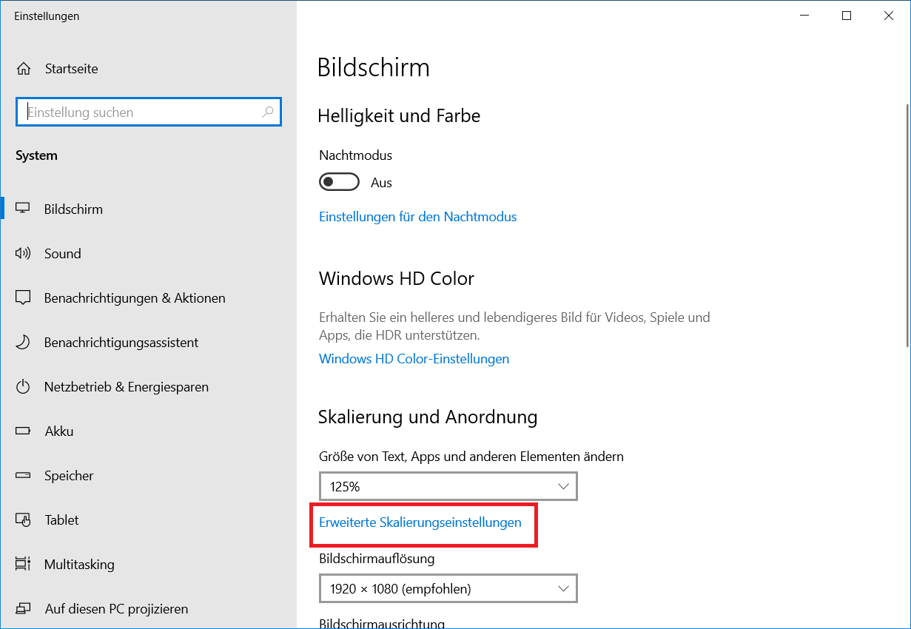
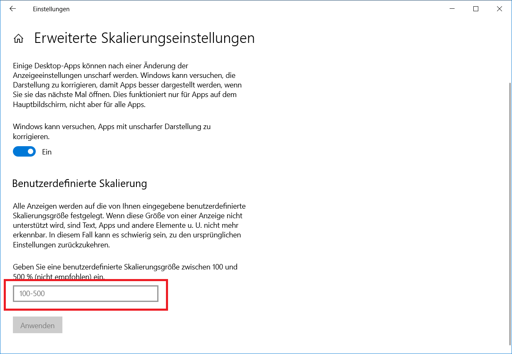
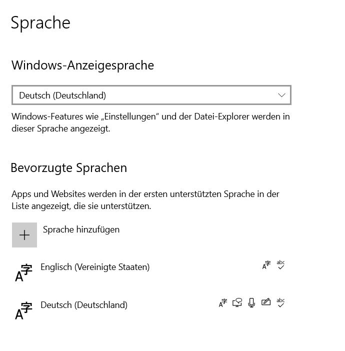

## Installation

Open the installer in us/

## How to build a new keyboard 

Install Microsoft Keyboard Layout Creator

- Download from https://www.microsoft.com/en-us/download/details.aspx?id=102134
- If keyboard is not visible, adjust screen settings:

Open Source File and Build

Set english as the new default language (by moving it to the top):

